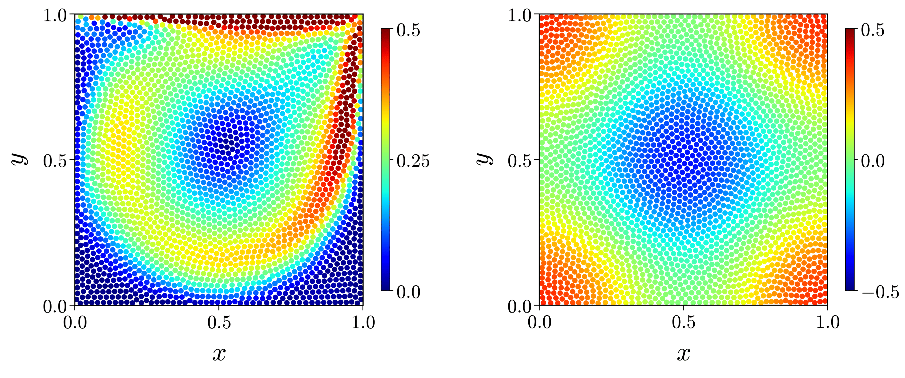

# LS-SPH-Fluid-Simulator

This is an open-source fluid simulation code based on the Least Squares Smoothed Particle Hydrodynamics (LS-SPH) [[1](#ref1)], a high-precision and generalized extension of classical SPH.

This code provides the following features (📣 indicates new additions):
1. A variety of standard fluid benchmark problems, including:
   - 2D Taylor-Green vortex 📣
   - 2D Lid-driven cavity flow 📣
   - 2D Boussinesq convection 📣
2. Applications to geophysical and engineering problems (currently under development)



## 🎯 Features

- Implementation of both LS-SPH and classical SPH models
- Support for 2D fluid simulations
- Written in Fortran with OpenMP and Python

## ⚙️ Requirements

- Unix-like environment (Linux, macOS, or WSL on Windows)
- [Intel Fortran compiler](https://www.intel.com/content/www/us/en/developer/tools/oneapi/fortran-compiler.html#gs.n7d5f5) (using `ifx`)
- Intel MKL (Math Kernel Library) for linear algebra routines
- `make` utility for building Fortran files
- Python with common libraries (e.g., `matplotlib`, `scipy`)
- `ffmpeg` for movie generation

## 🖥️ Usage

The following example shows how to simulate the 2D Taylor-Green vortex:

1. Clone or download this repository to your computer.
2. Navigate to `sph_code/2d-fixed-wall/source_code/` .
3. Run `make` to build the program.
4. Run `./start_calculation` to start the simulation.
5. After the simulation finishes, run `TG_main.py` to generate figures.


> [!NOTE]
> To simulate other cases, please refer to the [User Manual (Japanese)](./manual.pdf) and set the appropriate parameters.

## 🧑‍💻 Citation

If you use this simulator in your research, please cite the following:

```bibtex
@article{shobuzako2025,
  author  = {Kensuke Shobuzako and Shigeo Yoshida and Yoshifumi Kawada and Ryosuke Nakashima and Shujiro Fujioka and Mitsuteru Asai},
  title   = {A generalized smoothed particle hydrodynamics method based on the moving least squares method and its discretization error estimation},
  journal = {Results in Applied Mathematics},
  volume  = {26},
  pages   = {100594},
  year    = {2025},
  issn    = {2590-0374},
  doi     = {10.1016/j.rinam.2025.100594},
  url     = {https://www.sciencedirect.com/science/article/pii/S2590037425000585}
}

```

## 📖 User Manual (Japanese Only)

Please refer to the [LS-SPH Fluid Simulator User Manual](./manual.pdf), which is written in Japanese.  

An English version is not currently available.  
Please consider using translation tools such as AI.

## 🤝 Contributing
Contributions are welcome!  
If you'd like to improve the code, report a bug, or add a new feature, feel free to submit a pull request.

Please see [CONTRIBUTORS.md](./CONTRIBUTORS.md) for contributor information.

## 🔍 References
<a id="ref1">[1]</a>　
K. Shobuzako, S. Yoshida, Y. Kawada, R. Nakashima, S. Fujioka, and M. Asai,  
"A generalized smoothed particle hydrodynamics method based on the moving least squares method and its discretization error estimation",  
*Results in Applied Mathematics*,
Vol. 26,
2025,
100594. ([https://doi.org/10.1016/j.rinam.2025.100594](https://doi.org/10.1016/j.rinam.2025.100594))

## 🪪 License

This project is licensed under the MIT License. See the [LICENSE](./LICENSE) for details.
